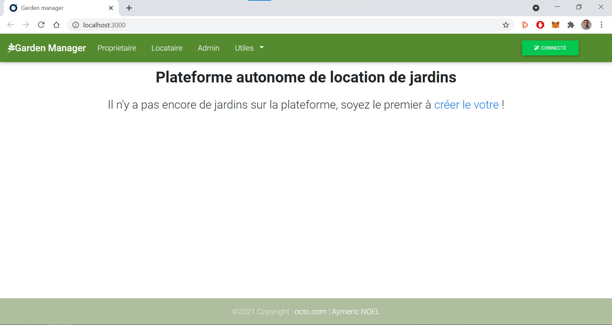
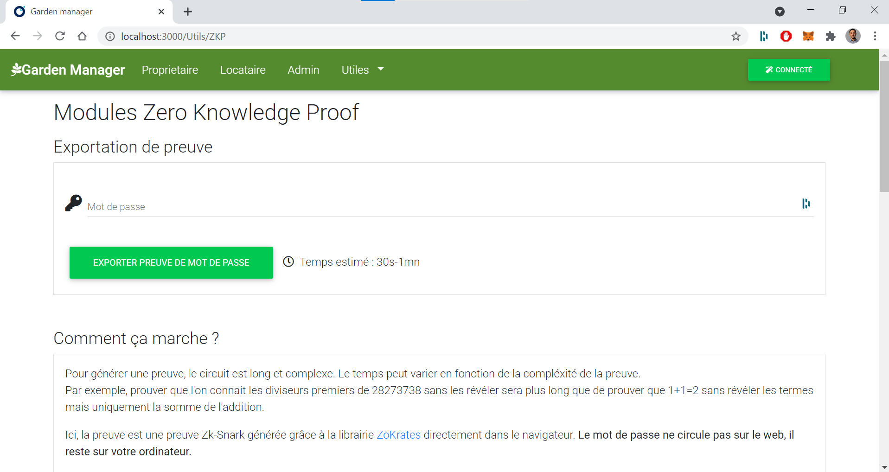

# Zero Knowledge Proof for garden rental

<details open="open">
  <summary><h2 style="display: inline-block">Table of Contents</h2></summary>
  <ol>
    <li>
      <a href="#about-the-project">About The Project</a>
      <ul>
        <li><a href="#built-with">Built With</a></li>
      </ul>
    </li>
    <li>
      <a href="#getting-started">Getting Started</a>
      <ul>
        <li><a href="#prerequisites">Prerequisites</a></li>
        <li><a href="#installation">Installation</a></li>
        <li><a href="#run-locally">Run Locally</a></li>
        <li><a href="#run-rinkeby">Run on Rinkeby</a></li>
        <li><a href="#tests">Tests</a></li>
      </ul>
    </li>
    <li><a href="#usage">Usage</a></li>
    <li><a href="#license">License</a></li>
    <li><a href="#contact">Contact</a></li>
  </ol>
</details>


____
## About The Project


This project aims to use Zero Knowledge Proof protocol to implement a Two Factor Authentication on blockchain.

<ins>How does it work?</ins>

Users of the site store the hash of their password onchain, then when they perform sensitive operations such as withdrawing ethers from the smart contract, they have to provide the ZKP proof that they know the pre-image of the hash and thus their password.
This way, even if a dishonest person manages to steal a user's ethereum private key, the thief will not be able to perform sensitive operations.

<br/>


<br/><br/>



### Built With

* [ZoKrates](https://github.com/Zokrates/ZoKrates)
* [Truffle](https://www.trufflesuite.com/truffle)
* [React](https://fr.reactjs.org/)
* [MDBootstrap](https://mdbootstrap.com/docs/react/)


## Getting Started

To get a local copy up and running follow these simple steps.

### Prerequisites

You need to have node and npm installed on your computer.
* Node <br/>
You can download node from the official [website](https://nodejs.org/en/download/).


* Npm
  ```sh
  npm install npm@latest -g
  ```

### Installation

1. Clone the repo
   ```sh
   git clone https://github.com/AymericNoel/POC_OCTO_ZKP.git
   ```
2. Install NPM packages
   ```sh
   npm install
   ```
3. Setup Zero Knowledge Proof locally
    ```sh
    npm run setup:zkp
    ```
4. Compile smart contracts locally
    ```sh
    npm run compile
    ```
### Run locally

1. Open a new terminal and launch *ganache-cli*
    ```sh
    npm run ganache
    ```
2. Put your ethereum addresses as administrators in [migration file](./migrations/2_contracts_migrations.js) in order to validate gardens
3. Deploy the smart contracts locally on ganache on the first terminal
    ```sh
    npm run migrate:ganache
    ```
4. Run website locally
    ```sh
    npm start
    ```
### Run locally

1. Create *.env* file at the root of the repo with your mnemonic and your infura api key :
   > MNEMONIC = "" 
   >
   > INFURAY_KEY = ""
2. Put your ethereum addresses as administrators in [migration file](./migrations/2_contracts_migrations.js) in order to validate gardens
3. Deploy the smart contracts on Rinkeby
    ```sh
    npm run migrate:rinkeby
    ```
4. Run website locally
    ```sh
    npm start
    ```
### Tests

1. Open a new terminal and launch *ganache-cli*
    ```sh
    npm run ganache
    ```
2. Run tests of smart contracts on the first terminal
    ```sh
    npm run test:sol
    ```
3. Run tests of website
    ```sh
    npm run test:js
    ```


<!-- USAGE EXAMPLES -->
## Usage

Use this website to make decentralized garden rentals. 
A minimum number of administrators must however be defined when deploying smart contracts in order to verify the existence of the different gardens.
Any owner can add his garden anonymously and any tenant can rent anonymously too.

**A demo can be found here : https://zeroknowledgegarden.surge.sh**

## License

Distributed under the MIT License. See `LICENSE` for more information.

## Contact

Aymeric NOEL - aymeric.noel@octo.com

Project Link : [https://github.com/AymericNoel/POC_OCTO_ZKP](https://github.com/AymericNoel/POC_OCTO_ZKP)
